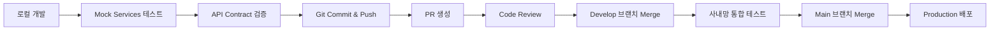

# 🌐 A2G Platform - 외부 개발 환경 가이드

**문서 버전**: 1.0
**최종 수정일**: 2025년 10월 27일
**작성자**: A2G Platform Development Team

---

## 1. 📋 개요 및 배경

### 1.1 목표
A2G Platform은 **8명의 개발자가 사외망(외부 네트워크)에서 동시에 개발**하고, 완성된 코드를 사내망으로 가져와 **통합 테스트 및 배포**하는 하이브리드 개발 전략을 채택합니다.

### 1.2 문제점
- **사내 리소스 접근 불가**: 사외망에서는 사내 DB, Redis, SSO 등의 엔드포인트에 직접 접근할 수 없습니다.
- **DB Migration 충돌**: 8명이 동일한 DB 인스턴스를 동시에 migration하면 스키마 충돌 및 데이터 손실이 발생합니다.
- **환경 일관성**: 각 개발자의 로컬 환경이 달라 통합 시 문제가 발생할 수 있습니다.

### 1.3 해결 전략
1. **Mock Backend Services**: 사외망에서 사용할 수 있는 경량 Mock SSO, DB, Redis 서비스를 Docker Compose로 구성합니다.
2. **API-First Development**: 모든 서비스 간 통신을 명확한 API 계약(OpenAPI Spec)으로 정의하고, 각 팀이 독립적으로 개발합니다.
3. **서비스 독립성**: 마이크로서비스 아키텍처(MSA)를 활용하여 각 서비스가 독립적으로 실행 및 테스트 가능하도록 구성합니다.
4. **환경 변수 기반 전환**: `.env.external` (사외망용)과 `.env.internal` (사내망용) 파일을 분리하여 엔드포인트만 교체하면 동작하도록 설계합니다.

---

## 2. 🏗️ 외부 개발 환경 아키텍처

### 2.1 전체 구조도

```
┌─────────────────────────── 사외망 (External Network) ────────────────────────────┐
│                                                                                    │
│  ┌──────────────┐   ┌──────────────┐   ┌──────────────┐   ┌──────────────┐     │
│  │  Developer   │   │  Developer   │   │  Developer   │   │  Developer   │     │
│  │     #1-2     │   │     #3-4     │   │     #5-6     │   │     #7-8     │     │
│  │ (Frontend)   │   │(User-Service)│   │(Agent/Chat)  │   │(Tracing/Wkr) │     │
│  └──────┬───────┘   └──────┬───────┘   └──────┬───────┘   └──────┬───────┘     │
│         │                   │                   │                   │              │
│         └───────────────────┴───────────────────┴───────────────────┘              │
│                                     │                                              │
│         ┌───────────────────────────▼───────────────────────────┐                 │
│         │          Mock Services (Docker Compose)               │                 │
│         │  ┌──────────────┐  ┌──────────────┐  ┌──────────────┐│                 │
│         │  │  Mock SSO    │  │  PostgreSQL  │  │    Redis     ││                 │
│         │  │  (FastAPI)   │  │  (Localhost) │  │ (Localhost)  ││                 │
│         │  │ Port: 9999   │  │ Port: 5432   │  │ Port: 6379   ││                 │
│         │  └──────────────┘  └──────────────┘  └──────────────┘│                 │
│         └─────────────────────────────────────────────────────────┘                 │
│                                                                                    │
└────────────────────────────────────────────────────────────────────────────────────┘

                                     ⬇️  (Code Transfer via Git)

┌─────────────────────────── 사내망 (Internal Network) ────────────────────────────┐
│                                                                                    │
│         ┌─────────────────────────────────────────────────────┐                  │
│         │      Production/Staging Environment                 │                  │
│         │  ┌──────────────┐  ┌──────────────┐  ┌──────────┐  │                  │
│         │  │  Real SSO    │  │  Real DB     │  │ Real Redis│  │                  │
│         │  │  (Company)   │  │  (a2g-db.com)│  │ (Company) │  │                  │
│         │  │ Port: 443    │  │ Port: 5432   │  │Port: 6379 │  │                  │
│         │  └──────────────┘  └──────────────┘  └──────────┘  │                  │
│         └─────────────────────────────────────────────────────┘                  │
│                                                                                    │
└────────────────────────────────────────────────────────────────────────────────────┘
```

### 2.2 핵심 원칙

1. **동일한 API 인터페이스**: Mock과 Real 서비스는 동일한 API 스펙을 제공해야 합니다.
2. **환경 변수로 전환**: 코드 수정 없이 `.env` 파일만 교체하면 사내/사외 환경 전환이 가능해야 합니다.
3. **로컬 DB 독립성**: 각 개발자는 자신만의 PostgreSQL 인스턴스를 사용합니다 (Docker Volume 분리).
4. **API Contract Testing**: 각 서비스는 OpenAPI 스펙을 준수하며, 계약 테스트를 통과해야 합니다.

---

## 3. 🔧 Mock Services 구성

### 3.1 Mock SSO Service

**목적**: 사내 SSO를 대체하는 간단한 인증 서비스
**기술 스택**: FastAPI (Python)
**주요 기능**:
- `/api/auth/login/` → 가짜 로그인 페이지 (하드코딩된 사용자 목록)
- `/api/auth/callback/` → id_token 발급 (JWT, 검증 없이 발급)
- 사용자 정보: `loginid`, `username`, `mail`, `deptname` 등 SSO_GUIDE.md 스펙 준수

**엔드포인트**:
```bash
# 사외망
IDP_ENTITY_ID="http://localhost:9999/mock-sso/login"
SP_REDIRECT_URL="https://localhost:9050/api/auth/callback/"

# 사내망
IDP_ENTITY_ID="https://real-sso.company.com/login"
SP_REDIRECT_URL="https://a2g-platform.company.com:9050/api/auth/callback/"
```

### 3.2 PostgreSQL (로컬)

**목적**: 각 개발자의 독립적인 데이터베이스
**구성**:
```yaml
# docker-compose.external.yml
services:
  postgres:
    image: postgres:15-alpine
    environment:
      POSTGRES_DB: agent_dev_platform_local
      POSTGRES_USER: dev_user
      POSTGRES_PASSWORD: dev_password
    ports:
      - "5432:5432"
    volumes:
      - postgres_data_local:/var/lib/postgresql/data

volumes:
  postgres_data_local:
```

**환경 변수**:
```bash
# .env.external (사외망)
DB_HOST=localhost
DB_NAME=agent_dev_platform_local
DB_USER=dev_user
DB_PASSWORD=dev_password

# .env.internal (사내망)
DB_HOST=a2g-db.com
DB_NAME=agent_development_platform
DB_USER=adp
DB_PASSWORD=a2g-passwd
```

### 3.3 Redis (로컬)

**목적**: Celery 메시지 브로커 및 캐시
**구성**:
```yaml
# docker-compose.external.yml
services:
  redis:
    image: redis:7-alpine
    command: redis-server --requirepass dev_redis_password
    ports:
      - "6379:6379"
```

**환경 변수**:
```bash
# .env.external (사외망)
REDIS_HOST=localhost
REDIS_PASSWORD=dev_redis_password

# .env.internal (사내망)
REDIS_HOST=redis.company.com
REDIS_PASSWORD=a2g-passwd
```

---

## 4. 🚀 개발 환경 설정 가이드

### 4.1 사전 준비

**필수 도구**:
- Docker Desktop (또는 Docker Engine + Docker Compose)
- Git
- Node.js 18+ (Frontend)
- Python 3.11+ (Backend)
- uv (Python 패키지 관리자)

### 4.2 저장소 클론

```bash
git clone https://github.com/A2G-Dev-Space/Agent-Platform-Development.git
cd Agent-Platform-Development

# 개발 브랜치 체크아웃
git checkout develop
```

### 4.3 Mock Services 실행

**Step 1**: Mock Services Docker Compose 실행
```bash
# 루트 디렉토리에서
docker-compose -f infra/docker-compose/docker-compose.external.yml up -d

# 확인
docker ps
# 출력: mock-sso, postgres, redis 컨테이너가 실행 중
```

**Step 2**: 환경 변수 설정
```bash
# 각 서비스 디렉토리에 .env.external 복사
cp services/user-service/.env.external.example services/user-service/.env
cp services/agent-service/.env.external.example services/agent-service/.env
# ... (나머지 서비스도 동일)

cp frontend/.env.external.example frontend/.env
```

**Step 3**: 데이터베이스 초기화
```bash
cd services/user-service  # (또는 admin-service - Django가 있는 곳)
uv run python manage.py migrate
uv run python manage.py createsuperuser  # 개발용 관리자 계정 생성
```

### 4.4 서비스별 개발 서버 실행

**Frontend** (Developer #1-2):
```bash
cd frontend
npm install
npm run dev
# http://localhost:9060
```

**User Service** (Developer #3-4):
```bash
cd services/user-service
uv sync
uv run uvicorn main:app --reload --port 8001
# http://localhost:8001
```

**Agent Service** (Developer #5):
```bash
cd services/agent-service
uv sync
uv run uvicorn main:app --reload --port 8002
# http://localhost:8002
```

**Chat Service** (Developer #6):
```bash
cd services/chat-service
uv sync
uv run uvicorn main:app --reload --port 8003
# http://localhost:8003
```

**Tracing Service** (Developer #7):
```bash
cd services/tracing-service
# Go 또는 Rust 프로젝트
go run main.go  # 또는 cargo run
# http://localhost:8004
```

**Worker Service** (Developer #8):
```bash
cd services/worker-service
uv run celery -A worker worker --loglevel=info

# 별도 터미널에서 Beat 실행
uv run celery -A worker beat --loglevel=info
```

---

## 5. 🔄 개발 워크플로우

### 5.1 일반적인 개발 사이클



### 5.2 브랜치 전략

- `main`: 운영 환경 (사내망 전용)
- `develop`: 통합 개발 브랜치 (사내망에서 테스트)
- `feature/[TASK-ID]-description`: 개발자 개인 작업 브랜치 (사외망)

**예시**:
```bash
# Developer #1 (Frontend)
git checkout -b feature/TASK-101-add-agent-card-ui

# 작업 후
git add .
git commit -m "feat(frontend): Add agent card UI component"
git push origin feature/TASK-101-add-agent-card-ui

# GitHub에서 PR 생성 (target: develop)
```

### 5.3 통합 테스트 프로세스

**사외망 → 사내망 이전 시**:
1. 개발자가 PR을 `develop` 브랜치로 머지
2. 사내망 CI/CD 서버가 코드를 pull
3. `.env.internal` 환경 변수 사용
4. 통합 테스트 실행
5. 성공 시 `main` 브랜치 머지 승인

---

## 6. 📝 API 계약 기반 개발

### 6.1 OpenAPI Specification

모든 백엔드 서비스는 OpenAPI 3.0 스펙을 제공해야 합니다.

**예시** (Agent Service):
```yaml
# services/agent-service/openapi.yaml
openapi: 3.0.0
info:
  title: Agent Service API
  version: 1.0.0
paths:
  /api/agents/:
    get:
      summary: List all agents
      responses:
        '200':
          description: Agent list
          content:
            application/json:
              schema:
                type: array
                items:
                  $ref: '#/components/schemas/Agent'
    post:
      summary: Create new agent
      requestBody:
        required: true
        content:
          application/json:
            schema:
              $ref: '#/components/schemas/AgentCreate'
      responses:
        '201':
          description: Agent created
components:
  schemas:
    Agent:
      type: object
      properties:
        id:
          type: integer
        name:
          type: string
        framework:
          type: string
          enum: [Agno, Custom, ADK, Langchain]
```

### 6.2 계약 테스트 (Pact/Postman)

각 서비스는 API 계약을 준수하는지 자동 테스트해야 합니다.

```bash
# Agent Service 계약 테스트
cd services/agent-service
pytest tests/contract/test_agent_api.py
```

---

## 7. 🐛 문제 해결 가이드

### 7.1 Mock SSO 로그인 실패

**증상**: 로그인 후 토큰이 발급되지 않음
**원인**: Mock SSO의 인증서가 설정되지 않음
**해결**:
```bash
# Mock SSO는 인증서 검증 없이 토큰 발급
# backend/.env.external에서 CERT_FILE 경로를 mock-sso/certs/mock-cert.cer로 설정
```

### 7.2 DB Migration 충돌

**증상**: `django.db.utils.OperationalError: relation "xxx" already exists`
**원인**: 다른 개발자가 이미 동일한 마이그레이션을 생성함
**해결**:
```bash
# 최신 develop 브랜치 pull 후 migration 재생성
git pull origin develop
cd services/admin-service
uv run python manage.py makemigrations --merge
uv run python manage.py migrate
```

### 7.3 Redis 연결 실패 (Celery)

**증상**: `celery.exceptions.OperationalError: Error 111 connecting to localhost:6379. Connection refused.`
**원인**: Redis 컨테이너가 실행되지 않음
**해결**:
```bash
docker-compose -f infra/docker-compose/docker-compose.external.yml up -d redis
```

---

## 8. 📚 참고 문서

- [SSO_GUIDE.md](./SSO_GUIDE.md): SSO 연동 상세 가이드
- [API_CONTRACTS.md](./API_CONTRACTS.md): 서비스 간 API 계약서
- [TEAM_ASSIGNMENT.md](./TEAM_ASSIGNMENT.md): 개발자별 작업 분할 계획
- [MOCK_SERVICES.md](./MOCK_SERVICES.md): Mock 서비스 구현 가이드

---

## 9. ⚠️ 주의사항

1. **절대 사내 자격증명을 외부에 노출하지 마세요**: `.env.internal` 파일은 절대 Git에 커밋하지 않습니다.
2. **Mock 데이터만 사용**: 사외망에서는 실제 고객 데이터를 사용하지 않습니다.
3. **정기적인 동기화**: `develop` 브랜치를 매일 pull하여 최신 상태를 유지합니다.
4. **API 계약 준수**: 임의로 API 스펙을 변경하지 않고, 변경 시 팀과 협의합니다.

---

**문의**: syngha.han@samsung.com
