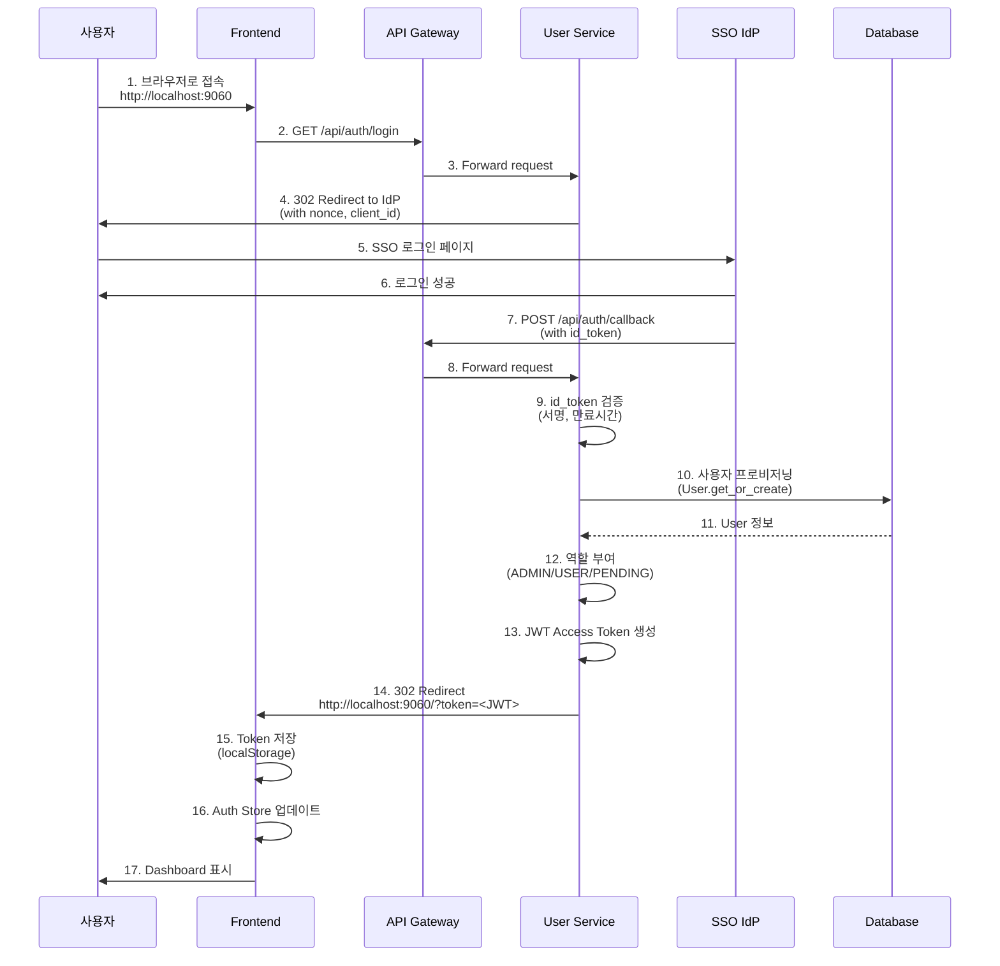
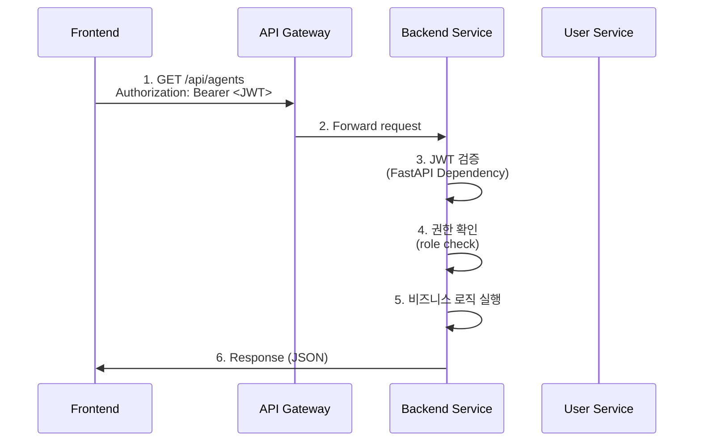

# 🔐 A2G Platform - SSO Authentication Guide (FastAPI)

**문서 버전**: 2.0
**최종 수정일**: 2025년 10월 27일
**기술 스택**: FastAPI, JWT, PostgreSQL
**아키텍처**: Microservice Architecture

---

## 📋 목차

1. [개요](#1-개요)
2. [전체 인증 흐름](#2-전체-인증-흐름)
3. [User Service 구현](#3-user-service-구현)
4. [Frontend 통합](#4-frontend-통합)
5. [Mock SSO 설정](#5-mock-sso-설정)
6. [API Key 인증](#6-api-key-인증)
7. [보안 고려사항](#7-보안-고려사항)

---

## 1. 개요

### 1.1 인증 아키텍처

A2G Platform은 **사내 SSO(OIDC)와 내부 JWT 기반 인증**을 결합한 하이브리드 인증 시스템을 사용합니다.

```
┌─────────────────────────────────────────────────────────────┐
│                       사용자                                 │
└────────────────┬────────────────────────────────────────────┘
                 │
                 ▼
┌────────────────────────────────────────────────────────────┐
│               Frontend (React SPA)                          │
│                http://localhost:9060                        │
└────────────────┬───────────────────────────────────────────┘
                 │
                 ▼
┌────────────────────────────────────────────────────────────┐
│            API Gateway (Nginx)                              │
│           https://localhost:9050                            │
└────────────────┬───────────────────────────────────────────┘
                 │
                 ▼
┌────────────────────────────────────────────────────────────┐
│         User Service (FastAPI :8001)                        │
│                                                              │
│  ┌──────────────────────────────────────────────────┐      │
│  │  /api/auth/login        - SSO 로그인 시작       │      │
│  │  /api/auth/callback     - SSO 콜백 처리         │      │
│  │  /api/auth/logout       - 로그아웃              │      │
│  └──────────────────────────────────────────────────┘      │
│                                                              │
│  ┌──────────────────────────────────────────────────┐      │
│  │  사용자 프로비저닝                               │      │
│  │  - DB에 사용자 정보 저장                         │      │
│  │  - 역할(PENDING/USER/ADMIN) 부여               │      │
│  │  - JWT Access Token 발급                        │      │
│  └──────────────────────────────────────────────────┘      │
└────────────────┬───────────────────────────────────────────┘
                 │
                 ▼
┌────────────────────────────────────────────────────────────┐
│         PostgreSQL Database                                 │
│  - users (username, email, role, department)               │
│  - api_keys (key, user_id, created_at)                     │
└────────────────────────────────────────────────────────────┘
```

### 1.2 인증 방식

| 방식 | 사용 시나리오 | 토큰 유형 |
|------|--------------|----------|
| **SSO (OIDC)** | 사용자 웹 브라우저 로그인 | id_token (외부) → JWT (내부) |
| **JWT Bearer** | Frontend API 호출 | `Authorization: Bearer <token>` |
| **API Key** | Agent 서버 → Platform API 호출 | `X-API-Key: <key>` |

### 1.3 역할 기반 접근 제어 (RBAC)

| 역할 | 설명 | 권한 |
|------|------|------|
| **PENDING** | 신규 사용자 (승인 대기) | 로그인만 가능, 기능 사용 불가 |
| **USER** | 일반 사용자 | Agent 개발/테스트, Playground 사용 |
| **ADMIN** | 관리자 | 모든 기능 + 사용자 관리, LLM 관리, 통계 |

---

## 2. 전체 인증 흐름

### 2.1 SSO 로그인 플로우



### 2.2 API 호출 플로우



---

## 3. User Service 구현

### 3.1 프로젝트 구조

```
agent-platform-user-service/
├── app/
│   ├── main.py                 # FastAPI 앱 진입점
│   ├── models.py               # SQLAlchemy 모델
│   ├── schemas.py              # Pydantic 스키마
│   ├── database.py             # DB 연결
│   ├── routers/
│   │   ├── auth.py             # SSO 인증 라우터
│   │   ├── users.py            # 사용자 관리 라우터
│   │   └── api_keys.py         # API Key 라우터
│   ├── services/
│   │   ├── auth_service.py     # 인증 비즈니스 로직
│   │   └── user_service.py     # 사용자 비즈니스 로직
│   └── dependencies.py         # FastAPI 의존성
├── requirements.txt
├── Dockerfile
└── .env
```

### 3.2 데이터베이스 모델

```python
# app/models.py
from sqlalchemy import Column, Integer, String, DateTime, Enum as SQLEnum
from sqlalchemy.ext.declarative import declarative_base
from datetime import datetime
import enum

Base = declarative_base()

class UserRole(str, enum.Enum):
    PENDING = "PENDING"
    USER = "USER"
    ADMIN = "ADMIN"

class User(Base):
    __tablename__ = "users"

    id = Column(Integer, primary_key=True, index=True)
    username = Column(String, unique=True, index=True, nullable=False)  # 사번
    email = Column(String, unique=True, index=True)
    role = Column(SQLEnum(UserRole), default=UserRole.PENDING, nullable=False)

    # SSO 정보
    username_kr = Column(String)  # 한글 이름
    username_en = Column(String)  # 영문 이름
    deptname_kr = Column(String)  # 부서명 (한글)
    deptname_en = Column(String)  # 부서명 (영문)

    # 사용자 설정
    theme_preference = Column(String, default="light")  # light, dark
    language_preference = Column(String, default="ko")  # ko, en

    created_at = Column(DateTime, default=datetime.utcnow)
    updated_at = Column(DateTime, default=datetime.utcnow, onupdate=datetime.utcnow)

class APIKey(Base):
    __tablename__ = "api_keys"

    id = Column(Integer, primary_key=True, index=True)
    key = Column(String, unique=True, index=True, nullable=False)
    user_id = Column(Integer, nullable=False)  # Foreign Key to User
    description = Column(String)
    created_at = Column(DateTime, default=datetime.utcnow)
    expires_at = Column(DateTime, nullable=True)
```

### 3.3 Pydantic 스키마

```python
# app/schemas.py
from pydantic import BaseModel, EmailStr
from typing import Optional
from datetime import datetime

class UserBase(BaseModel):
    username: str
    email: EmailStr

class UserCreate(UserBase):
    username_kr: Optional[str] = None
    username_en: Optional[str] = None
    deptname_kr: Optional[str] = None
    deptname_en: Optional[str] = None

class UserResponse(UserBase):
    id: int
    role: str
    username_kr: Optional[str]
    username_en: Optional[str]
    deptname_kr: Optional[str]
    deptname_en: Optional[str]
    theme_preference: str
    language_preference: str
    created_at: datetime

    class Config:
        from_attributes = True

class TokenResponse(BaseModel):
    access_token: str
    token_type: str = "bearer"
    user: UserResponse
```

### 3.4 SSO 인증 라우터

```python
# app/routers/auth.py
from fastapi import APIRouter, HTTPException, Depends, Form
from fastapi.responses import RedirectResponse
from sqlalchemy.orm import Session
from datetime import datetime, timedelta
import jwt
import uuid
import os
from typing import Optional

from ..database import get_db
from ..models import User, UserRole
from ..schemas import TokenResponse, UserResponse
from ..dependencies import get_current_user

router = APIRouter(prefix="/api/auth", tags=["Authentication"])

# 환경 변수
IDP_ENTITY_ID = os.getenv("IDP_ENTITY_ID")
IDP_CLIENT_ID = os.getenv("IDP_CLIENT_ID")
SP_REDIRECT_URL = os.getenv("SP_REDIRECT_URL")
FRONTEND_BASE_URL = os.getenv("FRONTEND_BASE_URL", "http://localhost:9060")
INITIAL_ADMIN_IDS = os.getenv("INITIAL_ADMIN_IDS", "").split(',')
JWT_SECRET_KEY = os.getenv("JWT_SECRET_KEY", "your-secret-key-change-in-production")
JWT_ALGORITHM = "HS256"
JWT_ACCESS_TOKEN_EXPIRE_HOURS = 12

# 세션 저장소 (Production에서는 Redis 사용)
sso_sessions = {}

@router.get("/login")
async def sso_login():
    """
    1. SSO 로그인 시작: 사용자를 IdP(회사 SSO) 로그인 페이지로 리디렉션
    """
    nonce = str(uuid.uuid4())
    state = str(uuid.uuid4())

    # 세션 저장 (Production에서는 Redis)
    sso_sessions[state] = {
        "nonce": nonce,
        "created_at": datetime.utcnow()
    }

    # IdP 로그인 URL 구성
    params = {
        "client_id": IDP_CLIENT_ID,
        "redirect_uri": SP_REDIRECT_URL,
        "response_mode": "form_post",
        "response_type": "code id_token",
        "scope": "openid profile",
        "nonce": nonce,
        "state": state,
    }

    from urllib.parse import urlencode
    query_string = urlencode(params)
    login_url = f"{IDP_ENTITY_ID}?{query_string}"

    return RedirectResponse(url=login_url, status_code=302)


@router.post("/callback")
async def sso_callback(
    id_token: str = Form(...),
    state: Optional[str] = Form(None),
    db: Session = Depends(get_db)
):
    """
    2. SSO 콜백 처리: id_token 검증, 사용자 프로비저닝, JWT 발급
    """
    # id_token 검증 (서명, 만료시간)
    try:
        # 실제 환경에서는 IdP 공개키로 검증
        # 여기서는 Mock SSO를 위해 검증 생략
        decoded_token = jwt.decode(
            id_token,
            options={"verify_signature": False}  # Mock SSO용
        )
    except jwt.InvalidTokenError as e:
        raise HTTPException(status_code=400, detail=f"Invalid token: {str(e)}")

    # 사용자 정보 추출
    user_id = decoded_token.get("loginid")
    if not user_id:
        raise HTTPException(status_code=400, detail="User ID (loginid) not found in token")

    email = decoded_token.get("mail", "")
    username_kr = decoded_token.get("username", "")
    username_en = decoded_token.get("username_en", "")
    deptname_kr = decoded_token.get("deptname", "")
    deptname_en = decoded_token.get("deptname_en", "")

    # 사용자 프로비저닝 (DB에 저장 또는 업데이트)
    user = db.query(User).filter(User.username == user_id).first()

    if not user:
        # 신규 사용자 생성
        role = UserRole.ADMIN if user_id in INITIAL_ADMIN_IDS else UserRole.PENDING
        user = User(
            username=user_id,
            email=email,
            role=role,
            username_kr=username_kr,
            username_en=username_en,
            deptname_kr=deptname_kr,
            deptname_en=deptname_en,
        )
        db.add(user)
    else:
        # 기존 사용자 정보 업데이트
        user.email = email or user.email
        user.username_kr = username_kr or user.username_kr
        user.username_en = username_en or user.username_en
        user.deptname_kr = deptname_kr or user.deptname_kr
        user.deptname_en = deptname_en or user.deptname_en

        # 관리자 목록에 있으면 ADMIN 권한 부여
        if user_id in INITIAL_ADMIN_IDS and user.role != UserRole.ADMIN:
            user.role = UserRole.ADMIN

    db.commit()
    db.refresh(user)

    # 내부 JWT Access Token 생성
    access_token = create_access_token(
        data={
            "user_id": user.username,
            "email": user.email,
            "role": user.role.value,
            "username_kr": user.username_kr,
            "username_en": user.username_en,
            "deptname_kr": user.deptname_kr,
            "deptname_en": user.deptname_en,
        }
    )

    # Frontend로 리디렉션 (토큰 포함)
    frontend_url = f"{FRONTEND_BASE_URL}/?token={access_token}"
    return RedirectResponse(url=frontend_url, status_code=302)


@router.get("/logout")
async def sso_logout():
    """
    3. 로그아웃: IdP 중앙 로그아웃 페이지로 리디렉션
    """
    idp_logout_url = os.getenv("IDP_SIGNOUT_URL")
    if not idp_logout_url:
        return {"message": "Logged out successfully (IdP signout URL not configured)"}

    return RedirectResponse(url=idp_logout_url, status_code=302)


def create_access_token(data: dict) -> str:
    """
    JWT Access Token 생성
    """
    to_encode = data.copy()
    expire = datetime.utcnow() + timedelta(hours=JWT_ACCESS_TOKEN_EXPIRE_HOURS)
    to_encode.update({"exp": expire})

    encoded_jwt = jwt.encode(to_encode, JWT_SECRET_KEY, algorithm=JWT_ALGORITHM)
    return encoded_jwt
```

### 3.5 FastAPI 의존성 (JWT 검증)

```python
# app/dependencies.py
from fastapi import Depends, HTTPException, status
from fastapi.security import HTTPBearer, HTTPAuthorizationCredentials
from sqlalchemy.orm import Session
import jwt
import os

from .database import get_db
from .models import User, UserRole

JWT_SECRET_KEY = os.getenv("JWT_SECRET_KEY", "your-secret-key-change-in-production")
JWT_ALGORITHM = "HS256"

security = HTTPBearer()

def get_current_user(
    credentials: HTTPAuthorizationCredentials = Depends(security),
    db: Session = Depends(get_db)
) -> User:
    """
    JWT 토큰을 검증하고 현재 사용자를 반환하는 의존성
    """
    token = credentials.credentials

    try:
        payload = jwt.decode(token, JWT_SECRET_KEY, algorithms=[JWT_ALGORITHM])
        user_id: str = payload.get("user_id")
        if user_id is None:
            raise HTTPException(
                status_code=status.HTTP_401_UNAUTHORIZED,
                detail="Invalid authentication credentials",
            )
    except jwt.ExpiredSignatureError:
        raise HTTPException(
            status_code=status.HTTP_401_UNAUTHORIZED,
            detail="Token has expired",
        )
    except jwt.InvalidTokenError:
        raise HTTPException(
            status_code=status.HTTP_401_UNAUTHORIZED,
            detail="Invalid token",
        )

    # DB에서 사용자 조회
    user = db.query(User).filter(User.username == user_id).first()
    if user is None:
        raise HTTPException(
            status_code=status.HTTP_404_NOT_FOUND,
            detail="User not found",
        )

    return user


def get_current_admin(current_user: User = Depends(get_current_user)) -> User:
    """
    ADMIN 권한 확인 의존성
    """
    if current_user.role != UserRole.ADMIN:
        raise HTTPException(
            status_code=status.HTTP_403_FORBIDDEN,
            detail="Admin access required",
        )
    return current_user


def get_current_active_user(current_user: User = Depends(get_current_user)) -> User:
    """
    PENDING이 아닌 활성 사용자 확인 의존성
    """
    if current_user.role == UserRole.PENDING:
        raise HTTPException(
            status_code=status.HTTP_403_FORBIDDEN,
            detail="Account pending approval",
        )
    return current_user
```

### 3.6 Main FastAPI 앱

```python
# app/main.py
from fastapi import FastAPI
from fastapi.middleware.cors import CORSMiddleware
from .routers import auth, users, api_keys
from .database import engine, Base

# DB 테이블 생성 (Alembic으로 마이그레이션 권장)
Base.metadata.create_all(bind=engine)

app = FastAPI(
    title="A2G User Service",
    description="User authentication and management service",
    version="1.0.0",
)

# CORS 설정
app.add_middleware(
    CORSMiddleware,
    allow_origins=["http://localhost:9060", "https://localhost:9050"],
    allow_credentials=True,
    allow_methods=["*"],
    allow_headers=["*"],
)

# 라우터 등록
app.include_router(auth.router)
app.include_router(users.router)
app.include_router(api_keys.router)

@app.get("/health")
async def health_check():
    return {"status": "healthy", "service": "user-service"}
```

---

## 4. Frontend 통합

### 4.1 Zustand Auth Store

```typescript
// src/store/useAuthStore.ts
import { create } from 'zustand';
import { persist } from 'zustand/middleware';
import axios from 'axios';
import { jwtDecode } from 'jwt-decode';

interface User {
  username: string;
  email: string;
  role: 'PENDING' | 'USER' | 'ADMIN';
  username_kr: string;
  username_en: string;
  deptname_kr: string;
  deptname_en: string;
}

interface AuthStore {
  token: string | null;
  user: User | null;
  isAuthenticated: boolean;

  login: (token: string) => void;
  logout: () => void;
  checkAuthAndLogin: (urlToken: string | null) => void;
}

export const useAuthStore = create<AuthStore>()(
  persist(
    (set, get) => ({
      token: null,
      user: null,
      isAuthenticated: false,

      login: (token: string) => {
        try {
          const decoded = jwtDecode<any>(token);
          const user: User = {
            username: decoded.user_id,
            email: decoded.email,
            role: decoded.role,
            username_kr: decoded.username_kr,
            username_en: decoded.username_en,
            deptname_kr: decoded.deptname_kr,
            deptname_en: decoded.deptname_en,
          };

          set({ token, user, isAuthenticated: true });

          // Axios 기본 헤더 설정
          axios.defaults.headers.common['Authorization'] = `Bearer ${token}`;
        } catch (error) {
          console.error('Failed to decode token:', error);
        }
      },

      logout: () => {
        set({ token: null, user: null, isAuthenticated: false });
        delete axios.defaults.headers.common['Authorization'];
        localStorage.removeItem('auth-storage');

        // SSO 로그아웃으로 리디렉션
        window.location.href = 'https://localhost:9050/api/auth/logout';
      },

      checkAuthAndLogin: (urlToken: string | null) => {
        if (urlToken) {
          // URL에서 토큰을 받은 경우 (SSO 콜백)
          get().login(urlToken);
        } else {
          // 기존 토큰 확인 (새로고침 시)
          const { token } = get();
          if (token) {
            try {
              const decoded = jwtDecode<any>(token);
              const now = Date.now() / 1000;
              if (decoded.exp < now) {
                // 토큰 만료
                get().logout();
              } else {
                // 토큰 유효
                axios.defaults.headers.common['Authorization'] = `Bearer ${token}`;
              }
            } catch {
              get().logout();
            }
          }
        }
      },
    }),
    {
      name: 'auth-storage',
    }
  )
);
```

### 4.2 Layout 컴포넌트

```tsx
// src/components/layout/Layout.tsx
import { useEffect } from 'react';
import { Outlet, useLocation, Navigate } from 'react-router-dom';
import { useAuthStore } from '../../store/useAuthStore';
import WorkspaceHeader from './WorkspaceHeader';
import PendingApprovalPage from '../../pages/PendingApprovalPage';

export default function Layout() {
  const { isAuthenticated, role, checkAuthAndLogin } = useAuthStore();
  const location = useLocation();

  useEffect(() => {
    // SSO 콜백에서 토큰 추출
    const params = new URLSearchParams(location.search);
    const token = params.get('token');

    if (token) {
      checkAuthAndLogin(token);
      // URL에서 토큰 제거
      window.history.replaceState({}, document.title, location.pathname);
    } else {
      // 기존 토큰 확인
      checkAuthAndLogin(null);
    }
  }, [location.search, checkAuthAndLogin]);

  // 인증되지 않은 경우 SSO 로그인으로 리디렉션
  if (!isAuthenticated) {
    window.location.href = 'https://localhost:9050/api/auth/login';
    return <div>Redirecting to login...</div>;
  }

  // PENDING 사용자는 승인 대기 페이지 표시
  if (role === 'PENDING') {
    return <PendingApprovalPage />;
  }

  return (
    <div className="flex flex-col h-screen">
      <WorkspaceHeader />
      <main className="flex-1 overflow-y-auto">
        <Outlet />
      </main>
    </div>
  );
}
```

### 4.3 Axios 인터셉터

```typescript
// src/services/api.ts
import axios from 'axios';
import { useAuthStore } from '../store/useAuthStore';

const api = axios.create({
  baseURL: 'https://localhost:9050',
  timeout: 10000,
});

// 요청 인터셉터: 토큰 자동 추가
api.interceptors.request.use(
  (config) => {
    const token = useAuthStore.getState().token;
    if (token) {
      config.headers.Authorization = `Bearer ${token}`;
    }
    return config;
  },
  (error) => Promise.reject(error)
);

// 응답 인터셉터: 인증 오류 처리
api.interceptors.response.use(
  (response) => response,
  (error) => {
    if (error.response?.status === 401) {
      // 토큰 만료 또는 인증 실패
      useAuthStore.getState().logout();
    }
    return Promise.reject(error);
  }
);

export default api;
```

---

## 5. Mock SSO 설정

### 5.1 Mock SSO 구현

```python
# mock-sso/main.py
from fastapi import FastAPI, Form
from fastapi.responses import HTMLResponse, RedirectResponse
import jwt
from datetime import datetime, timedelta

app = FastAPI(title="Mock SSO Service")

# Mock 사용자 데이터
MOCK_USERS = {
    "syngha.han": {
        "loginid": "syngha.han",
        "username": "한승하",
        "username_en": "Syngha Han",
        "mail": "syngha.han@samsung.com",
        "deptname": "플랫폼개발팀",
        "deptname_en": "Platform Development Team",
    },
    "john.doe": {
        "loginid": "john.doe",
        "username": "홍길동",
        "username_en": "John Doe",
        "mail": "john.doe@samsung.com",
        "deptname": "AI연구팀",
        "deptname_en": "AI Research Team",
    },
}

@app.get("/mock-sso/login", response_class=HTMLResponse)
async def mock_sso_login(
    client_id: str,
    redirect_uri: str,
    response_mode: str,
    response_type: str,
    scope: str,
    nonce: str,
    state: str = None,
):
    """
    Mock SSO 로그인 페이지
    """
    html_content = f"""
    <!DOCTYPE html>
    <html>
    <head>
        <title>Mock SSO Login</title>
        <style>
            body {{
                font-family: Arial, sans-serif;
                max-width: 500px;
                margin: 100px auto;
                padding: 20px;
            }}
            .user-card {{
                border: 1px solid #ddd;
                border-radius: 8px;
                padding: 15px;
                margin: 10px 0;
                cursor: pointer;
            }}
            .user-card:hover {{
                background-color: #f0f0f0;
            }}
        </style>
    </head>
    <body>
        <h1>Mock SSO Login</h1>
        <p>사용자를 선택하세요:</p>

        {''.join([f'''
        <div class="user-card" onclick="login('{user_id}')">
            <strong>{data['username']}</strong> ({user_id})<br>
            <small>{data['mail']}</small>
        </div>
        ''' for user_id, data in MOCK_USERS.items()])}

        <form id="loginForm" method="POST" action="/mock-sso/authorize" style="display:none">
            <input type="hidden" name="user_id" id="user_id">
            <input type="hidden" name="redirect_uri" value="{redirect_uri}">
            <input type="hidden" name="nonce" value="{nonce}">
            <input type="hidden" name="state" value="{state or ''}">
        </form>

        <script>
            function login(userId) {{
                document.getElementById('user_id').value = userId;
                document.getElementById('loginForm').submit();
            }}
        </script>
    </body>
    </html>
    """
    return HTMLResponse(content=html_content)


@app.post("/mock-sso/authorize")
async def mock_sso_authorize(
    user_id: str = Form(...),
    redirect_uri: str = Form(...),
    nonce: str = Form(...),
    state: str = Form(None),
):
    """
    Mock SSO 인증 처리 및 id_token 발급
    """
    if user_id not in MOCK_USERS:
        return {"error": "Invalid user"}

    user_data = MOCK_USERS[user_id]

    # id_token 생성 (JWT)
    payload = {
        **user_data,
        "nonce": nonce,
        "iat": datetime.utcnow(),
        "exp": datetime.utcnow() + timedelta(hours=1),
    }

    # Mock SSO는 서명 없이 발급 (테스트용)
    id_token = jwt.encode(payload, "mock-secret", algorithm="HS256")

    # Callback URL로 리디렉션 (POST)
    html_content = f"""
    <!DOCTYPE html>
    <html>
    <head>
        <title>Redirecting...</title>
    </head>
    <body>
        <p>Redirecting to callback...</p>
        <form id="callbackForm" method="POST" action="{redirect_uri}">
            <input type="hidden" name="id_token" value="{id_token}">
            <input type="hidden" name="state" value="{state or ''}">
        </form>
        <script>
            document.getElementById('callbackForm').submit();
        </script>
    </body>
    </html>
    """
    return HTMLResponse(content=html_content)
```

### 5.2 Mock SSO Docker Compose

```yaml
# docker-compose.external.yml (일부)
services:
  mock-sso:
    build: ./mock-sso
    ports:
      - "9999:9999"
    command: uvicorn main:app --host 0.0.0.0 --port 9999 --reload
```

### 5.3 환경 변수 설정

```bash
# .env.external (사외망)
IDP_ENTITY_ID=http://localhost:9999/mock-sso/login
IDP_CLIENT_ID=a2g-platform-dev
SP_REDIRECT_URL=https://localhost:9050/api/auth/callback
IDP_SIGNOUT_URL=http://localhost:9999/mock-sso/logout
FRONTEND_BASE_URL=http://localhost:9060
INITIAL_ADMIN_IDS=syngha.han,john.doe
JWT_SECRET_KEY=your-secret-key-change-in-production

# .env.internal (사내망)
IDP_ENTITY_ID=https://sso.company.com/login
IDP_CLIENT_ID=a2g-platform-prod
SP_REDIRECT_URL=https://a2g.company.com/api/auth/callback
IDP_SIGNOUT_URL=https://sso.company.com/logout
FRONTEND_BASE_URL=https://a2g.company.com
INITIAL_ADMIN_IDS=syngha.han,admin.user
JWT_SECRET_KEY=<production-secret-key>
```

---

## 6. API Key 인증

### 6.1 API Key 모델

Agent 서버가 Platform API를 호출할 때 사용하는 API Key 인증입니다.

```python
# app/routers/api_keys.py
from fastapi import APIRouter, Depends, HTTPException
from sqlalchemy.orm import Session
import secrets

from ..database import get_db
from ..models import APIKey, User
from ..dependencies import get_current_active_user
from ..schemas import APIKeyResponse, APIKeyCreate

router = APIRouter(prefix="/api/keys", tags=["API Keys"])

@router.post("/", response_model=APIKeyResponse)
async def create_api_key(
    data: APIKeyCreate,
    current_user: User = Depends(get_current_active_user),
    db: Session = Depends(get_db)
):
    """
    API Key 생성
    """
    # API Key 생성 (64자 랜덤 문자열)
    key = f"ak_{secrets.token_urlsafe(48)}"

    api_key = APIKey(
        key=key,
        user_id=current_user.id,
        description=data.description,
    )
    db.add(api_key)
    db.commit()
    db.refresh(api_key)

    return api_key


@router.get("/active", response_model=APIKeyResponse)
async def get_active_api_key(
    current_user: User = Depends(get_current_active_user),
    db: Session = Depends(get_db)
):
    """
    활성 API Key 조회
    """
    api_key = db.query(APIKey).filter(
        APIKey.user_id == current_user.id
    ).order_by(APIKey.created_at.desc()).first()

    if not api_key:
        raise HTTPException(status_code=404, detail="No API key found")

    return api_key
```

### 6.2 API Key 검증 미들웨어

```python
# app/dependencies.py (추가)
from fastapi import Header, HTTPException

def verify_api_key(
    x_api_key: str = Header(...),
    db: Session = Depends(get_db)
) -> User:
    """
    API Key 검증 의존성
    """
    api_key = db.query(APIKey).filter(APIKey.key == x_api_key).first()
    if not api_key:
        raise HTTPException(
            status_code=status.HTTP_401_UNAUTHORIZED,
            detail="Invalid API key",
        )

    # 사용자 조회
    user = db.query(User).filter(User.id == api_key.user_id).first()
    if not user:
        raise HTTPException(
            status_code=status.HTTP_404_NOT_FOUND,
            detail="User not found",
        )

    return user
```

---

## 7. 보안 고려사항

### 7.1 JWT Secret Key 관리

**Production 환경에서는 반드시 강력한 Secret Key를 사용하세요**:

```bash
# Secret Key 생성
python -c "import secrets; print(secrets.token_urlsafe(64))"
```

### 7.2 토큰 만료 시간

```python
JWT_ACCESS_TOKEN_EXPIRE_HOURS = 12  # 12시간
```

**권장사항**:
- 운영 환경: 2-4시간
- 개발 환경: 12-24시간

### 7.3 HTTPS 강제

**Production에서는 반드시 HTTPS를 사용하세요**:

```python
# app/main.py
from fastapi.middleware.httpsredirect import HTTPSRedirectMiddleware

if os.getenv("ENVIRONMENT") == "production":
    app.add_middleware(HTTPSRedirectMiddleware)
```

### 7.4 CORS 설정

```python
# 운영 환경에서는 명시적인 Origin만 허용
ALLOWED_ORIGINS = os.getenv("ALLOWED_ORIGINS", "").split(',')

app.add_middleware(
    CORSMiddleware,
    allow_origins=ALLOWED_ORIGINS,  # ["https://a2g.company.com"]
    allow_credentials=True,
    allow_methods=["GET", "POST", "PATCH", "DELETE"],
    allow_headers=["*"],
)
```

### 7.5 Rate Limiting

```python
# pip install slowapi
from slowapi import Limiter, _rate_limit_exceeded_handler
from slowapi.util import get_remote_address

limiter = Limiter(key_func=get_remote_address)
app.state.limiter = limiter

@app.post("/api/auth/login")
@limiter.limit("5/minute")  # 분당 5회 제한
async def login():
    ...
```

---

## 📚 참고 문서

- [FRONTEND_SETUP_GUIDE.md](./FRONTEND_SETUP_GUIDE.md) - Frontend 설정 가이드
- [ARCHITECTURE.md](./ARCHITECTURE.md) - 전체 아키텍처
- [API_CONTRACTS.md](./API_CONTRACTS.md) - API 계약서
- [MOCK_SERVICES.md](./MOCK_SERVICES.md) - Mock Services 구현

---

## ⚠️ Legacy 문서

**SSO_GUIDE.md**는 Django 기반의 레거시 가이드입니다. 새로운 구현은 이 문서(FastAPI)를 참조하세요.

---

**Contact**: syngha.han@samsung.com
**Repository**: [agent-platform-user-service](https://github.com/A2G-Dev-Space/agent-platform-user-service)
