# Advanced Markdown Features - Examples

This document showcases the advanced features of the MessageContent component including LaTeX math, Mermaid diagrams, and image rendering.

---

## 📐 LaTeX Math Rendering

### Inline Math

The quadratic formula is $x = \frac{-b \pm \sqrt{b^2 - 4ac}}{2a}$.

Einstein's famous equation: $E = mc^2$

The Pythagorean theorem: $a^2 + b^2 = c^2$

### Display Math (Block)

$$
\int_{-\infty}^{\infty} e^{-x^2} dx = \sqrt{\pi}
$$

$$
\sum_{n=1}^{\infty} \frac{1}{n^2} = \frac{\pi^2}{6}
$$

### Complex Equations

**Schrödinger Equation:**

$$
i\hbar\frac{\partial}{\partial t}\Psi(\mathbf{r},t) = \left[-\frac{\hbar^2}{2m}\nabla^2 + V(\mathbf{r},t)\right]\Psi(\mathbf{r},t)
$$

**Maxwell's Equations:**

$$
\begin{aligned}
\nabla \cdot \mathbf{E} &= \frac{\rho}{\epsilon_0} \\
\nabla \cdot \mathbf{B} &= 0 \\
\nabla \times \mathbf{E} &= -\frac{\partial \mathbf{B}}{\partial t} \\
\nabla \times \mathbf{B} &= \mu_0\mathbf{J} + \mu_0\epsilon_0\frac{\partial \mathbf{E}}{\partial t}
\end{aligned}
$$

### Matrices

$$
\begin{bmatrix}
a & b \\
c & d
\end{bmatrix}
\begin{bmatrix}
x \\
y
\end{bmatrix}
=
\begin{bmatrix}
ax + by \\
cx + dy
\end{bmatrix}
$$

### Statistical Formulas

**Normal Distribution:**

$$
f(x) = \frac{1}{\sigma\sqrt{2\pi}} e^{-\frac{1}{2}\left(\frac{x-\mu}{\sigma}\right)^2}
$$

**Bayes' Theorem:**

$$
P(A|B) = \frac{P(B|A) \cdot P(A)}{P(B)}
$$

---

## 📊 Mermaid Diagrams

### Flowchart

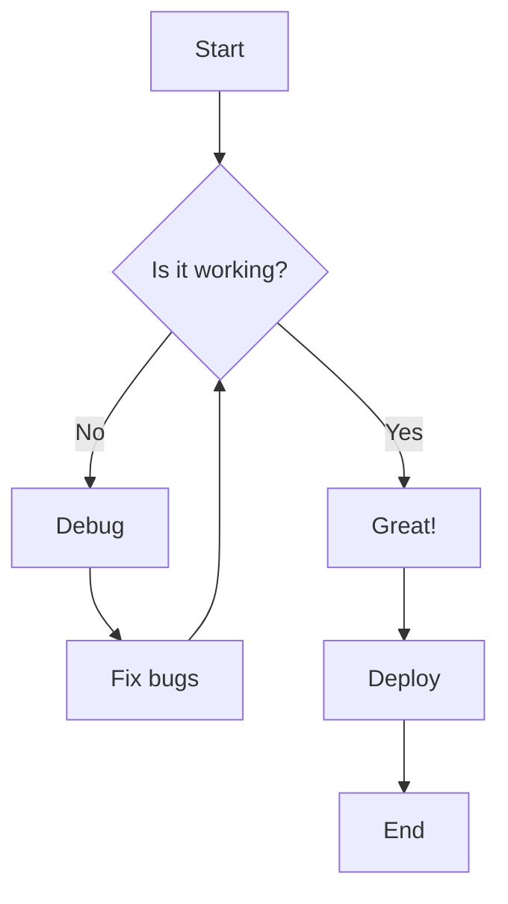

### Sequence Diagram

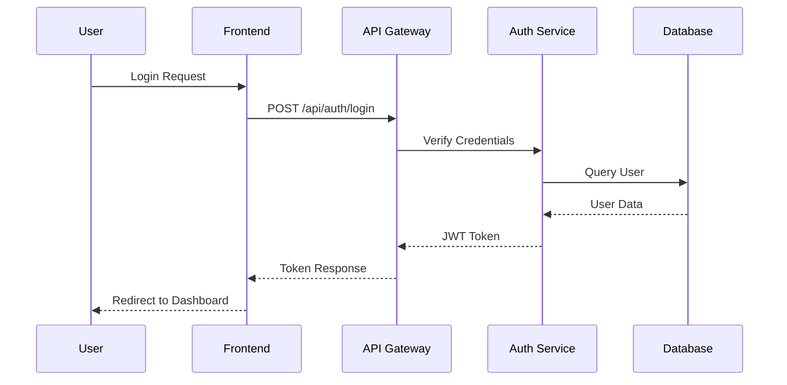

### Class Diagram

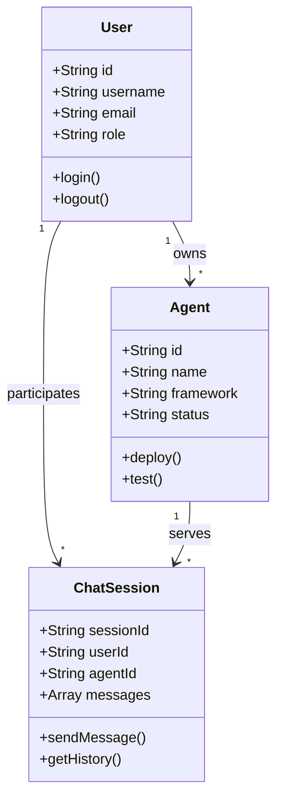

### State Diagram

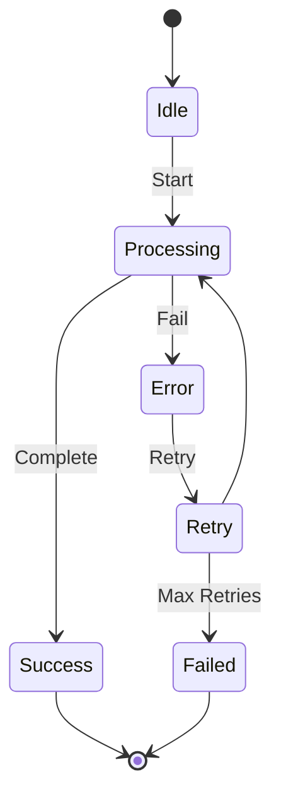

### Entity Relationship Diagram

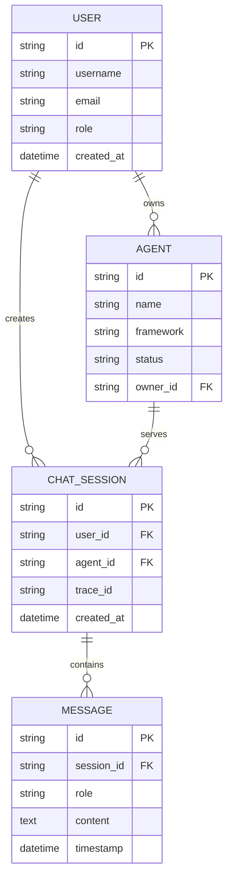

### Gantt Chart

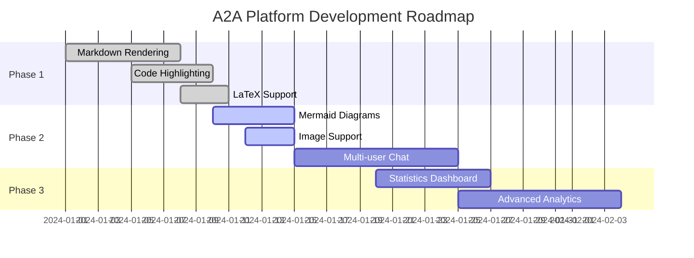

### Pie Chart

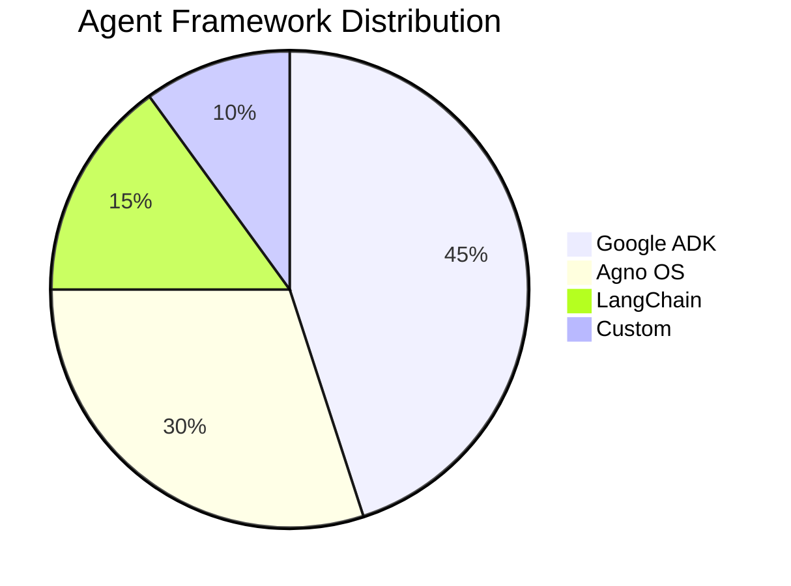

### Git Graph

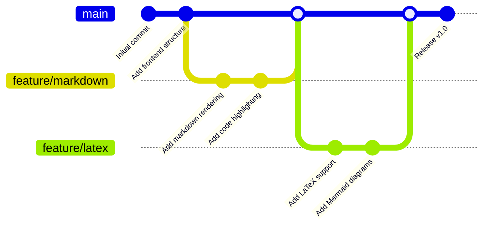

---

## 🖼️ Image Rendering

### Basic Image


*Click on the image to zoom in!*

### Multiple Images


### Image with Description

Here's an architectural diagram of our system:


The image above shows the microservices architecture with API Gateway, various services, and database layers.

---

## 🎯 Combined Examples

### Machine Learning Example

**Problem:** Predict house prices using linear regression.

**Formula:**

The prediction is given by:

$$
\hat{y} = \beta_0 + \beta_1 x_1 + \beta_2 x_2 + \cdots + \beta_n x_n
$$

Where:
- $\hat{y}$ is the predicted price
- $\beta_0$ is the intercept
- $\beta_i$ are the coefficients
- $x_i$ are the features

**Workflow:**

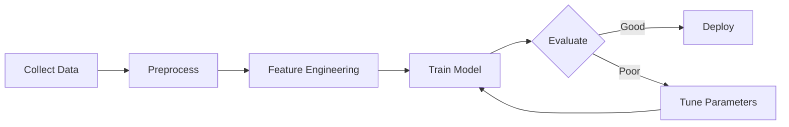

**Implementation:**

```python
import numpy as np
from sklearn.linear_model import LinearRegression

# Generate sample data
X = np.random.rand(100, 5)
y = 3*X[:, 0] + 2*X[:, 1] - X[:, 2] + np.random.randn(100) * 0.1

# Train model
model = LinearRegression()
model.fit(X, y)

# Prediction
print(f"R² score: {model.score(X, y):.4f}")
```

---

### API Documentation Example

**Endpoint:** `POST /api/v1/agents/`

**Request Body:**

```json
{
  "name": "MathAgent",
  "framework": "ADK",
  "description": "Solves mathematical problems",
  "a2a_endpoint": "https://example.com/agent"
}
```

**Flow Diagram:**

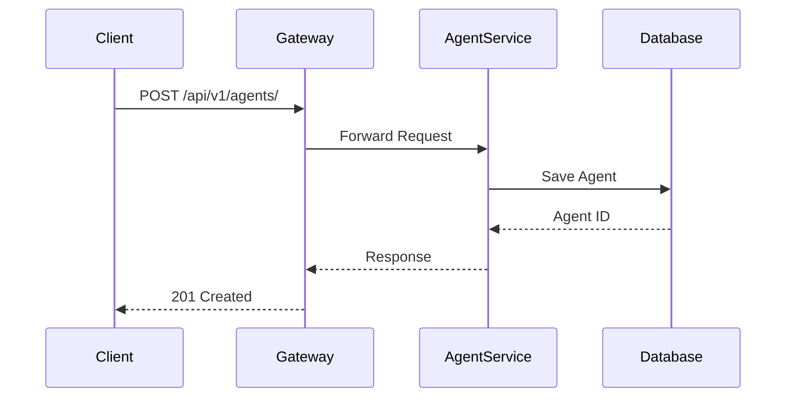

**Response:**

```json
{
  "id": 123,
  "name": "MathAgent",
  "framework": "ADK",
  "status": "DEVELOPMENT",
  "created_at": "2024-01-15T10:30:00Z"
}
```

---

### Data Structure Example

**Binary Search Tree Implementation:**

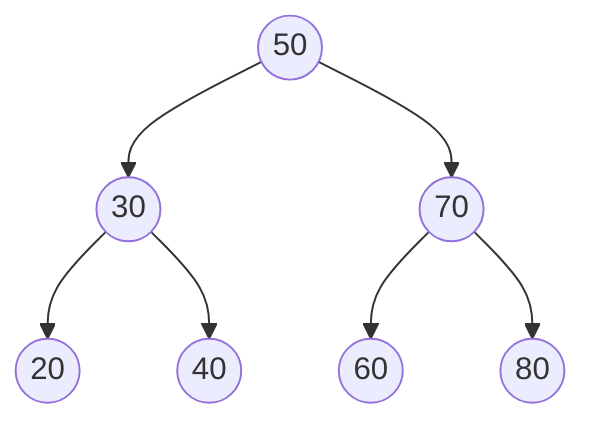

**Complexity Analysis:**

| Operation | Average Case | Worst Case |
|-----------|-------------|------------|
| Search | $O(\log n)$ | $O(n)$ |
| Insert | $O(\log n)$ | $O(n)$ |
| Delete | $O(\log n)$ | $O(n)$ |

**Code:**

```python
class TreeNode:
    def __init__(self, val):
        self.val = val
        self.left = None
        self.right = None

def search(root, target):
    """
    Search for target in BST.
    Time: O(log n) average, O(n) worst
    """
    if not root or root.val == target:
        return root

    if target < root.val:
        return search(root.left, target)
    else:
        return search(root.right, target)
```

---

### Physics Simulation Example

**Projectile Motion:**

The trajectory of a projectile is described by:

$$
\begin{aligned}
x(t) &= v_0 \cos(\theta) \cdot t \\
y(t) &= v_0 \sin(\theta) \cdot t - \frac{1}{2}gt^2
\end{aligned}
$$

**Visualization:**


**State Machine:**

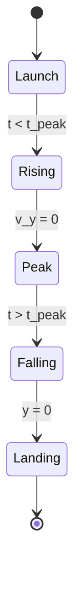

---

## 🧪 Testing Examples

### Test Coverage Report

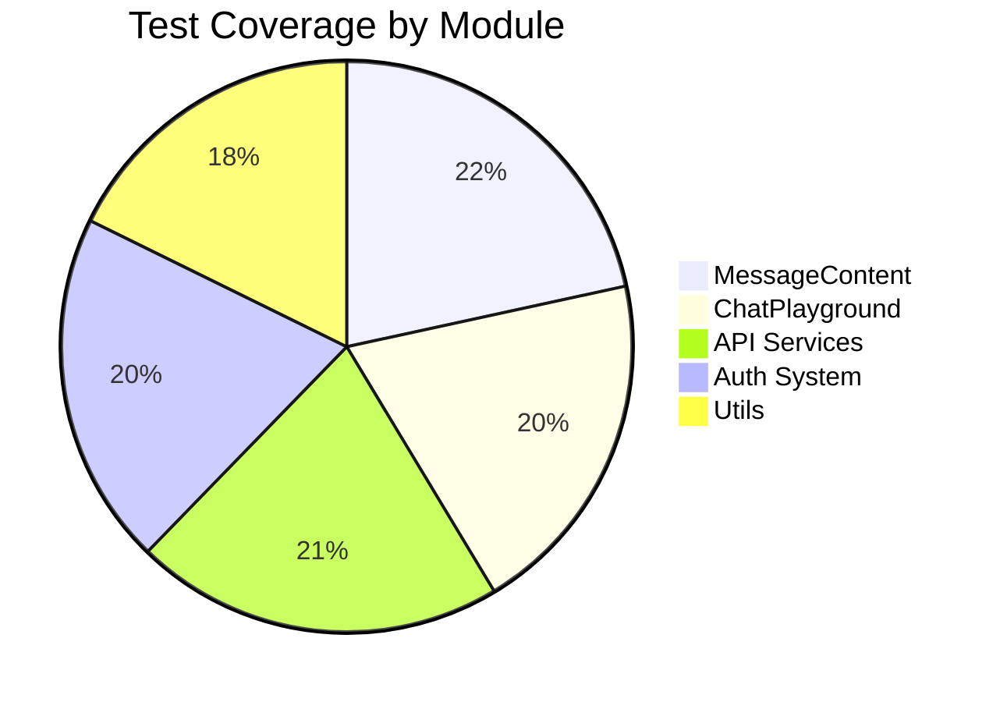

### CI/CD Pipeline

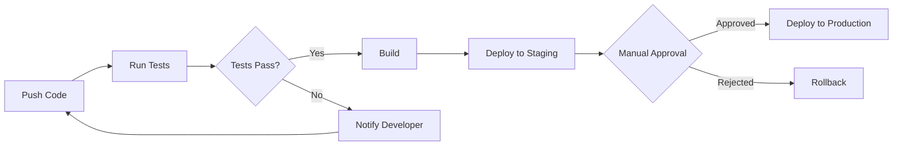

---

## 💡 Tips for Using Advanced Features

### LaTeX Math
- Use `$...$` for inline math
- Use `$$...$$` for display math (block)
- Requires `remark-math` and `rehype-katex` plugins

### Mermaid Diagrams
- Use triple backticks with `mermaid` language identifier
- Supports: flowcharts, sequence diagrams, class diagrams, state diagrams, ER diagrams, Gantt charts, pie charts, and more
- Requires `mermaid` package

### Images
- Standard markdown syntax: ``
- Click to zoom functionality with `react-medium-image-zoom`
- Responsive and lazy-loaded

---

## 🚀 Performance Notes

- **LaTeX**: Rendered client-side using KaTeX (fast)
- **Mermaid**: Rendered on-demand (slight delay for complex diagrams)
- **Images**: Lazy-loaded, zoom overlay only created on click
- **Overall**: Optimized for typical chat message sizes

---

## 🔗 Resources

- [KaTeX Supported Functions](https://katex.org/docs/supported.html)
- [Mermaid Documentation](https://mermaid.js.org/)
- [LaTeX Math Symbols](https://www.cmor-faculty.rice.edu/~heinken/latex/symbols.pdf)
- [GitHub Flavored Markdown](https://github.github.com/gfm/)
