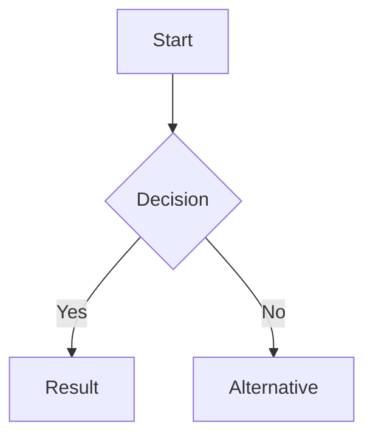
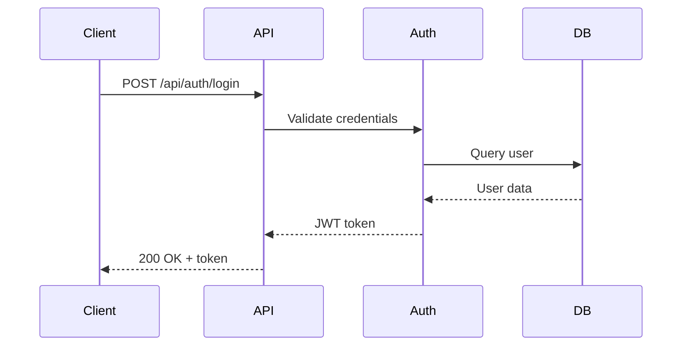
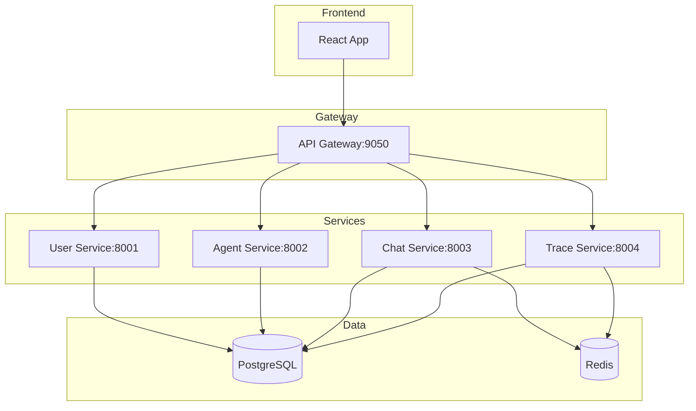

# 🎨 Rich Chat Interface - Complete Guide

## Overview

The A2A Agent Platform now features a **fully-featured rich chat interface** with support for:

- ✅ **Markdown** rendering (GitHub Flavored)
- ✅ **Code** syntax highlighting (100+ languages)
- ✅ **LaTeX** math equations
- ✅ **Mermaid** diagrams
- ✅ **Image** zoom/lightbox
- ✅ **Tables**, lists, blockquotes
- ✅ **URL** auto-linking
- ✅ **Task** lists

This transforms the chat from plain text to a **rich document editor** capable of displaying technical documentation, mathematical formulas, system diagrams, and more.

---

## 🚀 Quick Start

### For Users

Just chat normally! The AI agent's responses will automatically render with rich formatting.

**Example prompts that showcase features:**

```
"Explain the quadratic formula with LaTeX"
"Show me a flowchart of the authentication process"
"Write Python code to calculate fibonacci numbers"
"Create a database schema diagram"
```

### For Developers

```tsx
import { MessageContent } from '@/components/chat/MessageContent';

// Render markdown content
<MessageContent
  content={markdownString}
  contentType="markdown"  // or "text" for plain text
/>
```

---

## 📚 Feature Reference

### 1. Basic Markdown

```markdown
# Heading 1
## Heading 2

**Bold** and *italic* text

- List item 1
- List item 2

1. Numbered item
2. Another item

> Blockquote

---
```

### 2. Code Blocks

````markdown
```python
def hello_world():
    print("Hello, World!")
```
````

Features:
- Automatic language detection
- Syntax highlighting
- Copy button on each block
- Language badge

### 3. LaTeX Math

**Inline:** `$E = mc^2$` → $E = mc^2$

**Display (block):**
```markdown
$$
\int_{-\infty}^{\infty} e^{-x^2} dx = \sqrt{\pi}
$$
```

### 4. Mermaid Diagrams

````markdown

````

Supported types:
- `flowchart` / `graph`
- `sequenceDiagram`
- `classDiagram`
- `stateDiagram-v2`
- `erDiagram`
- `gantt`
- `pie`
- `gitGraph`

### 5. Images

```markdown

```

Click any image to zoom!

### 6. Tables

```markdown
| Header 1 | Header 2 |
|----------|----------|
| Cell 1   | Cell 2   |
| Cell 3   | Cell 4   |
```

### 7. Links

URLs are automatically converted to clickable links:
```markdown
Visit https://github.com
Or use [link text](https://example.com)
```

### 8. Task Lists

```markdown
- [x] Completed task
- [ ] Pending task
```

---

## 🎯 Real-World Examples

### Example 1: Algorithm Explanation

**User:** "Explain binary search with code and complexity"

**Agent Response:**

```markdown
# Binary Search Algorithm

Binary search is an efficient algorithm for finding an item in a sorted array.

## Implementation

```python
def binary_search(arr, target):
    left, right = 0, len(arr) - 1

    while left <= right:
        mid = (left + right) // 2

        if arr[mid] == target:
            return mid
        elif arr[mid] < target:
            left = mid + 1
        else:
            right = mid - 1

    return -1
```

## Complexity Analysis

| Case | Time Complexity |
|------|----------------|
| Best | $O(1)$ |
| Average | $O(\log n)$ |
| Worst | $O(\log n)$ |
| Space | $O(1)$ |

The algorithm works by repeatedly dividing the search interval in half.
```

### Example 2: API Documentation

**User:** "Document the user login API endpoint"

**Agent Response:**

````markdown
# User Login API

## Endpoint

`POST /api/auth/login`

## Request Flow



## Request Body

```json
{
  "email": "user@example.com",
  "password": "secure_password"
}
```

## Response

```json
{
  "access_token": "eyJhbGc...",
  "token_type": "Bearer",
  "expires_in": 3600
}
```

## Status Codes

| Code | Meaning |
|------|---------|
| 200 | Success |
| 401 | Invalid credentials |
| 429 | Rate limit exceeded |
````

### Example 3: System Architecture

**User:** "Show me the microservices architecture"

**Agent Response:**

````markdown
# A2A Platform Architecture



## Service Ports

| Service | Port | Purpose |
|---------|------|---------|
| Frontend | 9060 | UI |
| API Gateway | 9050 | Routing |
| User Service | 8001 | Auth & Users |
| Agent Service | 8002 | Agent CRUD |
| Chat Service | 8003 | Messaging |
| Trace Service | 8004 | Logging |
````

---

## 🛠️ Technical Details

### Dependencies

```json
{
  "react-markdown": "^10.1.0",
  "remark-gfm": "^4.0.0",
  "remark-breaks": "^4.0.0",
  "remark-math": "^6.0.0",
  "rehype-highlight": "^7.0.0",
  "rehype-raw": "^7.0.0",
  "rehype-katex": "^7.0.0",
  "mermaid": "^11.4.1",
  "react-medium-image-zoom": "^5.2.14",
  "katex": "^0.16.0"
}
```

### Component Architecture

```
MessageContent
├── ReactMarkdown (core rendering)
├── CodeBlock (syntax highlighting + copy)
├── MermaidDiagram (diagram rendering)
└── Zoom (image lightbox)
```

### Plugin Pipeline

```
Markdown Text
  ↓ remark-gfm (GitHub features)
  ↓ remark-breaks (line breaks)
  ↓ remark-math (LaTeX parsing)
  ↓ rehype-highlight (code syntax)
  ↓ rehype-raw (HTML support)
  ↓ rehype-katex (math rendering)
  ↓
Rendered HTML
```

### Performance

- **Markdown Parsing:** < 10ms for typical messages
- **Code Highlighting:** Auto-detect, < 50ms
- **LaTeX Rendering:** Client-side KaTeX, < 20ms
- **Mermaid Diagrams:** Async rendering, ~100-500ms
- **Images:** Lazy loaded

---

## 🎨 Styling & Theming

### Light/Dark Mode

All features support automatic dark mode:

- Syntax highlighting: GitHub Dark theme
- Math formulas: Inverted colors for dark mode
- Diagrams: Custom theme variables
- Images: Darkened overlay

### Customization

Edit `frontend/src/index.css` to customize:

```css
/* Markdown prose colors */
.prose {
    --tw-prose-body: var(--color-text-light-primary);
    --tw-prose-links: #3b82f6;
    --tw-prose-code: #ec4899;
}

/* Dark mode overrides */
[data-theme="dark"] .prose {
    --tw-prose-body: var(--color-text-dark-primary);
    --tw-prose-links: #60a5fa;
    --tw-prose-code: #f472b6;
}
```

---

## 📖 Documentation Files

- **CHAT_MARKDOWN_FEATURE.md** - Feature overview and technical docs
- **MARKDOWN_TEST_EXAMPLES.md** - Basic markdown test cases
- **ADVANCED_MARKDOWN_EXAMPLES.md** - LaTeX, Mermaid, advanced examples
- **RICH_CHAT_README.md** - This file

---

## 🧪 Testing

### Manual Testing

1. Start dev server: `npm run dev`
2. Navigate to Workbench
3. Select an agent
4. Send test messages from example files

### Test Cases

See `MARKDOWN_TEST_EXAMPLES.md` and `ADVANCED_MARKDOWN_EXAMPLES.md` for comprehensive test cases covering:

- All markdown syntax
- Multiple programming languages
- LaTeX equations
- Various diagram types
- Edge cases

---

## 🐛 Troubleshooting

### Issue: Code not highlighting

**Solution:** Check browser console for errors. Ensure highlight.js styles are loaded.

### Issue: Math not rendering

**Solution:** Verify KaTeX CSS is imported. Check for LaTeX syntax errors.

### Issue: Diagrams not showing

**Solution:**
- Check mermaid syntax in browser console
- Verify diagram is in a code fence with \`\`\`mermaid
- Check for initialization errors

### Issue: Images not loading

**Solution:**
- Check image URL is accessible
- Verify CORS settings if cross-origin
- Check browser network tab

### Issue: Copy button not working

**Solution:**
- Requires HTTPS in production
- Check clipboard permissions
- Verify browser compatibility

---

## 🚀 Future Enhancements

### Planned

- [ ] Collapsible code blocks (hide long code)
- [ ] Line numbers for code
- [ ] Diff syntax highlighting
- [ ] File attachment preview
- [ ] Video embedding
- [ ] Audio playback
- [ ] 3D model viewing

### Under Consideration

- [ ] PlantUML diagrams
- [ ] GraphViz graphs
- [ ] ASCII art rendering
- [ ] PDF preview
- [ ] Jupyter notebook rendering
- [ ] Interactive code playgrounds

---

## 💡 Tips for AI Agents

When generating responses for users:

1. **Use appropriate formatting:**
   - Code blocks for code
   - LaTeX for math
   - Mermaid for diagrams
   - Tables for comparisons

2. **Be consistent:**
   - Use proper language tags for code blocks
   - Close all fences properly
   - Use correct LaTeX delimiters

3. **Enhance readability:**
   - Break long content into sections
   - Use headings for structure
   - Include visual aids (diagrams)

4. **Examples work best:**
   - Show, don't just tell
   - Provide working code
   - Include step-by-step diagrams

---

## 📞 Support

For issues or questions:

- Check troubleshooting section above
- Review example documents
- Check browser console for errors
- Open issue on GitHub repository

---

## 📄 License

Part of the A2A Agent Platform project.

---

**Made with ❤️ by the A2A Team**

*Powered by: React, react-markdown, KaTeX, Mermaid, highlight.js*
