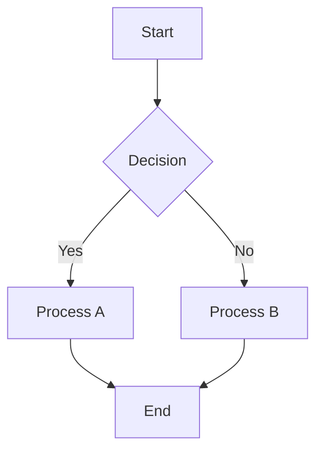
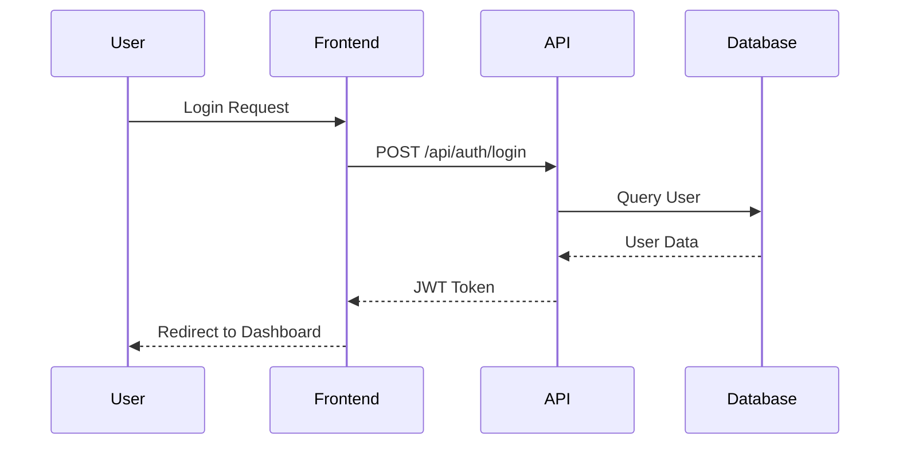
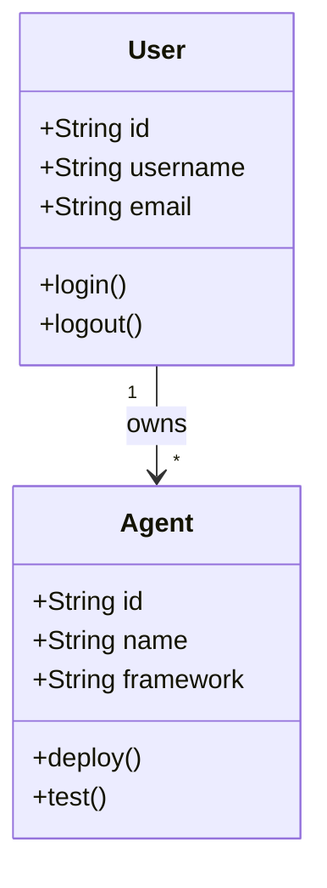
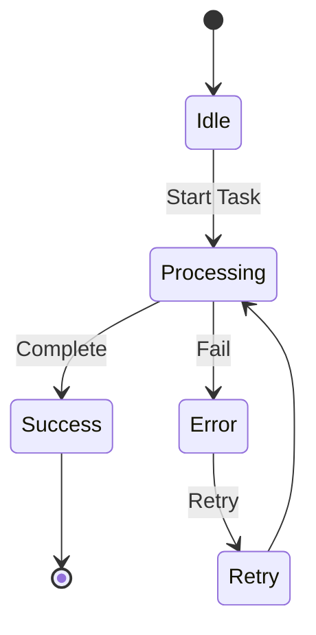
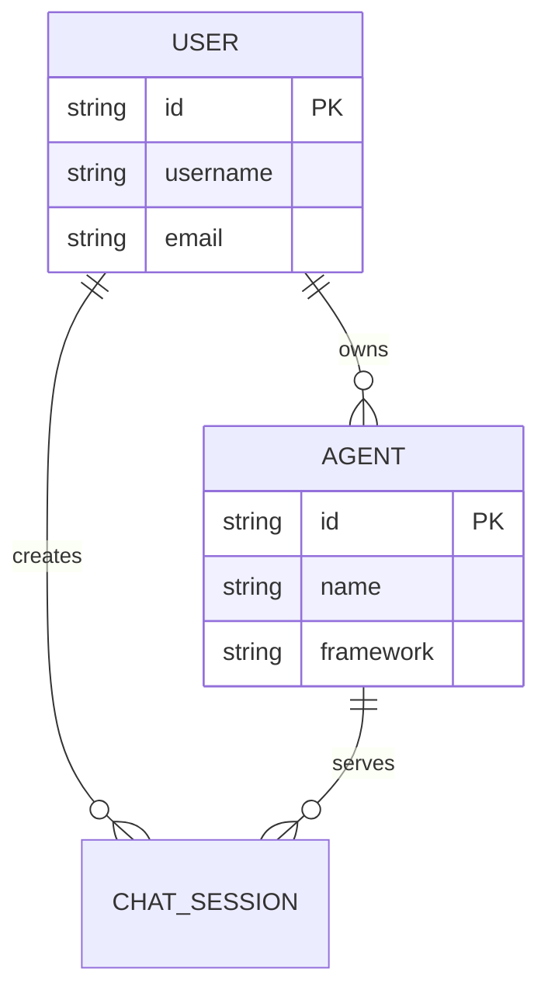
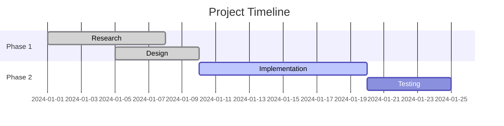
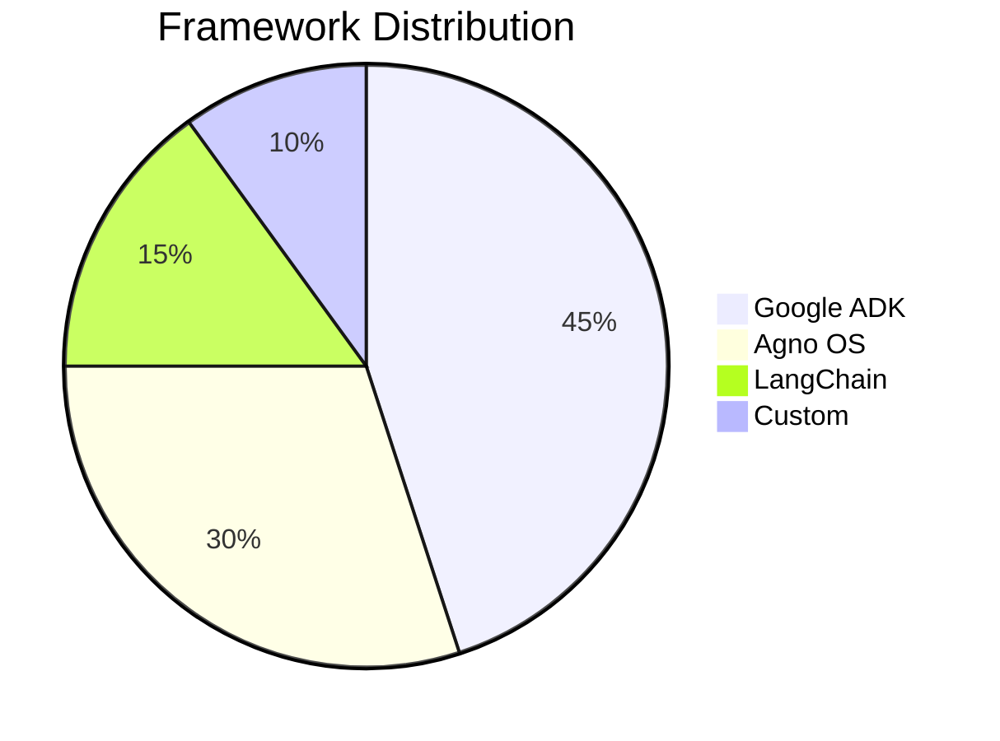
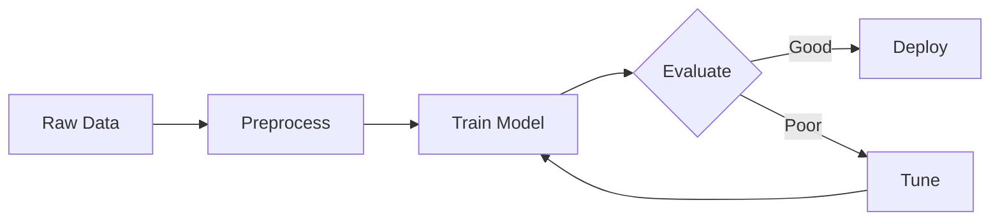
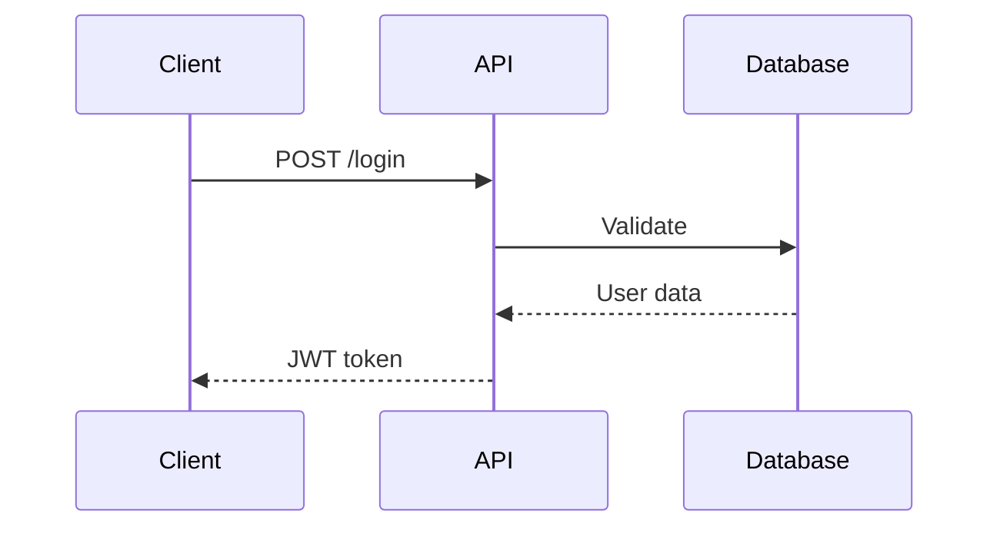

# What Playground Can Show

## Overview

The A2A Chat Playground supports rich markdown rendering with advanced features. This guide shows you what you can display and how to format your agent responses for the best user experience.

---

## 📋 Table of Contents

1. [Text Formatting](#1-text-formatting)
2. [Code Blocks](#2-code-blocks)
3. [Mathematics (LaTeX)](#3-mathematics-latex)
4. [Diagrams (Mermaid)](#4-diagrams-mermaid)
5. [Tables](#5-tables)
6. [Images](#6-images)
7. [Links](#7-links)
8. [Lists](#8-lists)
9. [Blockquotes](#9-blockquotes)
10. [Best Practices](#10-best-practices)

---

## 1. Text Formatting

### Basic Formatting

```markdown
# Heading 1
## Heading 2
### Heading 3

**Bold text**
*Italic text*
***Bold and italic***
~~Strikethrough~~

Horizontal rule:
---
```

### Task Lists

```markdown
- [x] Completed task
- [ ] Pending task
- [ ] Another pending task
```

**Renders as:**
- ✅ Completed task (checked)
- ⬜ Pending task (unchecked)

---

## 2. Code Blocks

### Features
- ✅ Syntax highlighting for 100+ languages
- ✅ Automatic line numbers (for multi-line code)
- ✅ Copy button
- ✅ Collapsible for long code (10+ lines)
- ✅ Language badge

### Inline Code

```markdown
Use `console.log()` to print output.
```

### Code Blocks with Language

````markdown
```python
def fibonacci(n):
    if n <= 1:
        return n
    return fibonacci(n-1) + fibonacci(n-2)

# Calculate first 10 fibonacci numbers
for i in range(10):
    print(f"fib({i}) = {fibonacci(i)}")
```
````

**Features:**
- Line numbers appear automatically (for 2+ lines)
- Copy button in top-right corner
- Collapse button appears for 10+ lines

### Supported Languages

**Popular:**
- `python`, `javascript`, `typescript`, `java`, `cpp`, `c`, `csharp`
- `go`, `rust`, `php`, `ruby`, `swift`, `kotlin`
- `html`, `css`, `sql`, `bash`, `shell`
- `json`, `yaml`, `xml`, `markdown`

**Full list:** 100+ languages supported by highlight.js

### Diff Syntax Highlighting

````markdown
```diff
--- a/server.js
+++ b/server.js
@@ -1,5 +1,5 @@
 const express = require('express');
-const port = 3000;
+const port = 8080;

 app.listen(port, () => {
-  console.log('Server on 3000');
+  console.log('Server on 8080');
 });
```
````

**Color coding:**
- 🟢 **Green background**: Added lines (start with `+`)
- 🔴 **Red background**: Deleted lines (start with `-`)
- 🔵 **Blue text**: Info headers (`---`, `+++`, `@@`)
- ⚪ **White text**: Context lines (unchanged)

---

## 3. Mathematics (LaTeX)

### Inline Math

```markdown
The quadratic formula is $x = \frac{-b \pm \sqrt{b^2 - 4ac}}{2a}$.

Einstein's equation: $E = mc^2$
```

### Display Math (Block)

```markdown
$$
\int_{-\infty}^{\infty} e^{-x^2} dx = \sqrt{\pi}
$$
```

### Complex Equations

**Schrödinger Equation:**
```markdown
$$
i\hbar\frac{\partial}{\partial t}\Psi(\mathbf{r},t) = \left[-\frac{\hbar^2}{2m}\nabla^2 + V(\mathbf{r},t)\right]\Psi(\mathbf{r},t)
$$
```

**Matrix:**
```markdown
$$
\begin{bmatrix}
a & b \\
c & d
\end{bmatrix}
\begin{bmatrix}
x \\
y
\end{bmatrix}
=
\begin{bmatrix}
ax + by \\
cx + dy
\end{bmatrix}
$$
```

**Statistical Formula:**
```markdown
$$
f(x) = \frac{1}{\sigma\sqrt{2\pi}} e^{-\frac{1}{2}\left(\frac{x-\mu}{\sigma}\right)^2}
$$
```

---

## 4. Diagrams (Mermaid)

### Flowchart

````markdown

````

### Sequence Diagram

````markdown

````

### Class Diagram

````markdown

````

### State Diagram

````markdown

````

### Entity Relationship Diagram

````markdown

````

### Gantt Chart

````markdown

````

### Pie Chart

````markdown

````

---

## 5. Tables

```markdown
| Feature | Status | Priority |
|---------|--------|----------|
| Markdown | ✅ Done | High |
| Code | ✅ Done | High |
| LaTeX | ✅ Done | Medium |
| Mermaid | ✅ Done | Medium |
| Images | ✅ Done | Low |
```

**Features:**
- Automatic borders and styling
- Responsive design
- Horizontal scroll for wide tables

---

## 6. Images

```markdown

```

**Features:**
- ✅ Click to zoom (lightbox)
- ✅ Lazy loading
- ✅ Responsive sizing
- ✅ Dark mode compatible

---

## 7. Links

### Markdown Links

```markdown
Visit [OpenAI](https://openai.com) for more info.
```

### Auto-linking

```markdown
https://github.com will automatically become a clickable link
```

**Features:**
- Opens in new tab (`target="_blank"`)
- Secure (`rel="noopener noreferrer"`)
- Custom styling

---

## 8. Lists

### Unordered Lists

```markdown
- Item 1
- Item 2
  - Nested item 2.1
  - Nested item 2.2
- Item 3
```

### Ordered Lists

```markdown
1. First step
2. Second step
3. Third step
```

---

## 9. Blockquotes

```markdown
> This is a blockquote.
> It can span multiple lines.
>
> And have multiple paragraphs.
```

---

## 10. Best Practices

### For Agent Developers

**1. Use Appropriate Formatting:**
- Use code blocks for code
- Use LaTeX for mathematical formulas
- Use Mermaid for system diagrams
- Use tables for comparisons

**2. Structure Your Responses:**
```markdown
# Main Topic

## Subtopic

Brief explanation...

### Example

```python
# Code example
```

### Explanation

More details...
```

**3. Break Long Content:**
- Use headings to structure content
- Break long code into sections
- Use collapsible code for lengthy examples (10+ lines auto-collapse)

**4. Enhance Readability:**
- Use bullet points for lists
- Use tables for structured data
- Use diagrams to visualize workflows
- Use blockquotes for important notes

**5. Combine Features:**

Example: Machine Learning Explanation
```markdown
# Binary Classification

## Problem
Given dataset with features $X$ and labels $y \in \{0, 1\}$, predict class.

## Formula
$$
P(y=1|X) = \sigma(w^T X + b) = \frac{1}{1 + e^{-(w^T X + b)}}
$$

## Workflow



## Implementation

```python
import numpy as np
from sklearn.linear_model import LogisticRegression

# Train model
model = LogisticRegression()
model.fit(X_train, y_train)

# Evaluate
accuracy = model.score(X_test, y_test)
print(f"Accuracy: {accuracy:.2%}")
```

## Results

| Metric | Value |
|--------|-------|
| Accuracy | 95.2% |
| Precision | 94.8% |
| Recall | 95.6% |
```

---

## 🎯 Quick Reference

### When to Use Each Feature

| Feature | Use Case | Example |
|---------|----------|---------|
| **Code Block** | Showing code, commands, configs | Function implementation |
| **Diff** | Showing changes, before/after | Code review, version updates |
| **LaTeX** | Mathematical formulas | Equations, statistical formulas |
| **Flowchart** | Process flow, decision trees | Algorithm steps |
| **Sequence** | API calls, interactions | Request/response flow |
| **Class** | Architecture, OOP design | System design |
| **State** | State machines, workflows | User journey, process states |
| **ER Diagram** | Database schema | Data relationships |
| **Gantt** | Project timeline | Development roadmap |
| **Pie Chart** | Distributions, percentages | Usage statistics |
| **Table** | Structured data, comparisons | Feature matrix, results |
| **Image** | Screenshots, diagrams | UI mockups, photos |
| **Blockquote** | Important notes, quotes | Warnings, citations |

---

## 🚀 Advanced Tips

### 1. Combining Multiple Features

Create comprehensive documentation by combining markdown features:

```markdown
# API Documentation

## Overview
This API provides user authentication services.

## Endpoint
`POST /api/auth/login`

## Request Flow



## Request Body

```json
{
  "username": "user@example.com",
  "password": "secure_password"
}
```

## Response Codes

| Code | Meaning | Description |
|------|---------|-------------|
| 200 | Success | Login successful |
| 401 | Unauthorized | Invalid credentials |
| 429 | Rate Limited | Too many attempts |

> **Note:** Passwords must be at least 8 characters.
```

### 2. Code Organization

For long code, let it auto-collapse:
- Code with 10+ lines automatically gets a collapse button
- Users can expand/collapse as needed
- Useful for showing complete implementations

### 3. Progressive Disclosure

Start with high-level overview, then provide details:

```markdown
# Solution

Quick answer: Use binary search - $O(\log n)$ complexity.

<details>
<summary>Click for detailed explanation</summary>

## Algorithm

```python
def binary_search(arr, target):
    left, right = 0, len(arr) - 1
    while left <= right:
        mid = (left + right) // 2
        if arr[mid] == target:
            return mid
        elif arr[mid] < target:
            left = mid + 1
        else:
            right = mid - 1
    return -1
```

## Complexity Analysis

| Case | Time | Space |
|------|------|-------|
| Best | $O(1)$ | $O(1)$ |
| Average | $O(\log n)$ | $O(1)$ |
| Worst | $O(\log n)$ | $O(1)$ |

</details>
```

---

## 📝 Message Copy Feature

Every message has a **Copy** button below it:
- Copies the entire message content
- Includes markdown formatting
- Useful for sharing responses

---

## 🎨 Visual Design

### Message Styling
- **User messages**: Light red border (rgba(234, 40, 49, 0.4))
- **Agent messages**: Dark red border (#EA2831)
- **Background**: White (light mode) / Dark gray (dark mode)
- All features adapt to light/dark theme automatically

---

## 🔧 Troubleshooting

### Code Not Highlighting
- Ensure you specify the language: ` ```python` not just ` ``` `
- Check spelling of language name

### Math Not Rendering
- Use `$` for inline: `$E = mc^2$`
- Use `$$` for display (block): `$$E = mc^2$$`
- Check LaTeX syntax

### Diagram Not Showing
- Verify Mermaid syntax
- Use proper diagram type keywords
- Check for syntax errors in console

### Image Not Loading
- Verify URL is accessible
- Check CORS settings for cross-origin images
- Ensure image format is supported (PNG, JPG, GIF, SVG)

---

## 📚 Resources

- [Markdown Guide](https://www.markdownguide.org/)
- [KaTeX Documentation](https://katex.org/docs/supported.html)
- [Mermaid Documentation](https://mermaid.js.org/)
- [Highlight.js Languages](https://github.com/highlightjs/highlight.js/blob/main/SUPPORTED_LANGUAGES.md)

---

**Last Updated:** 2025-01-13

**Made with ❤️ for A2A Agent Developers**
